# ETL-Project

Creating Database for Wildfire Economic Impact

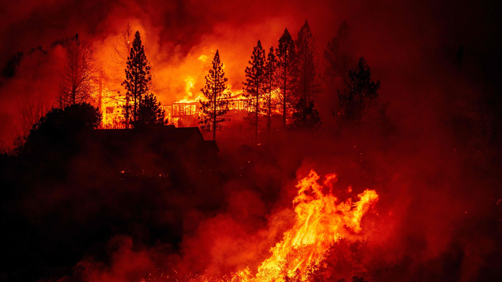

## Table of contents
* [The Ask](#the-ask)
* [Data Sources](#data-sources)
* [Technologies](#technologies)
* [Installation and Usage](#installation-and-usage)
* [Development Process](#development-process)
* [Data Products](#data-products)
* [Development Team](#development-team)

## The Ask
We are looking at the economic impact of natural disasters with a focus on wildfires. Which state has more disasters and what was the economic impact? How has the economic impact of wildfires changed since 1953? What role does location play in economic impact?

## Data Sources
“Federal Emergencies and Disasters, 1953-Present
Has the number of emergencies declared by the president risen over time?”
https://www.kaggle.com/fema/federal-disasters
“Natural disaster data
Occurrence and economic impact”
https://www.kaggle.com/dataenergy/natural-disaster-data?select=number-of-natural-disaster-events.csv

## Technologies
* Python - version 4.8.3
  * Pandas - version 1.0.5
  * Jupyter Notebook - version 6.0.3
* Postgres - version 12.5
  * pgAdmin 4 - version 4.23
 * Quick DBD
  
## Installation and Usage
* Open Jupyter Notebook in Python environment and import Pandas for data cleaning. 
* Create table schemata in Postgres to load CSV files.

## Development Process
Extract: First we extracted our data from Kaggle and opened in Jupyter Notebook in order to Transform.
Examples of raw economic and wildfire data that needed to be cleaned and merged by year.
1. 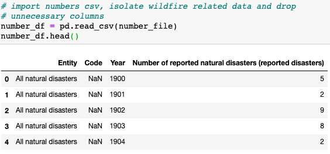
2. 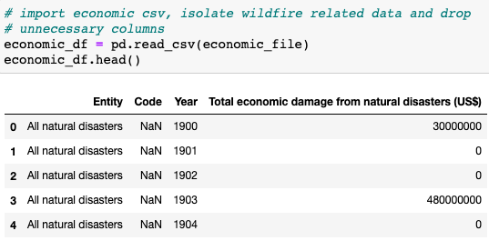

Transform: Cleaning, Filtering, Merging
Examples of data cleaning and filtering. Data was cleaned by renaming columns for ease of use and dropping columns no longer needed. Data was filtered by "Wildfire" to get relevant disaster data. 
1. 
2. 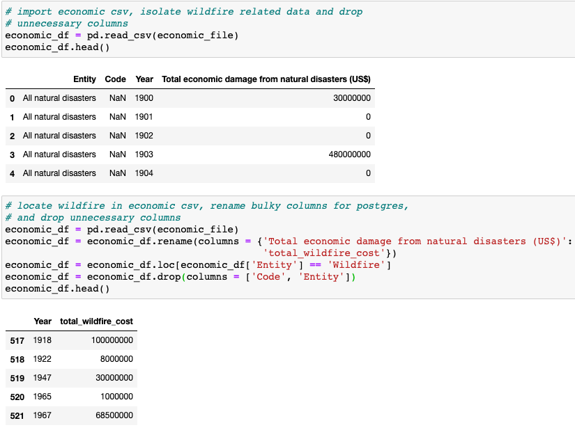

Example of data merging. Merged economic data with number of wildfires to create and annual data frame containing the economic cost and total number of wildfires.
1. 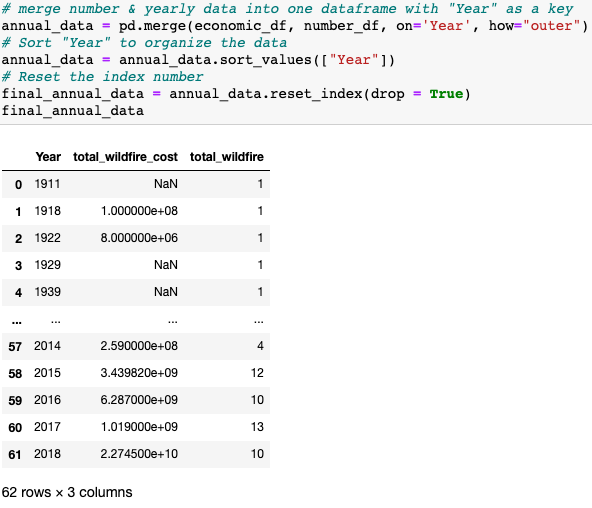

Load: We creating table schemata and related the databases to each other in SQL and stored the data in Postgres.
Our database is a relational and structured database with Year as the Primary Key, visualized by this ERD.
1. 

Created table schemata to load fema and economic diasaster data. 
1. 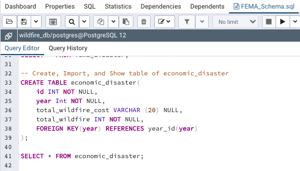
2. 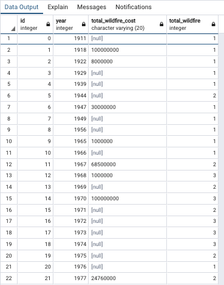
3. 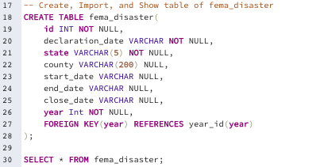
4. 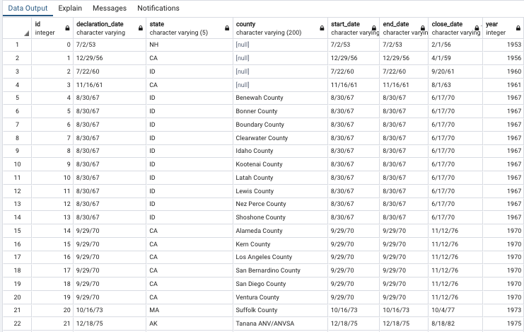

## Data Products 
We produced wildfire specific data on economic impacts. 
Example Queries:
* Find the year and counties of Fema wildfire diasters in NC.
1. 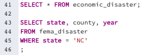
2. 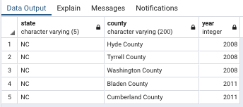
* Find all year, state, county, and cost of Fema wildfire disasters in 2012.
1. 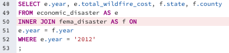
2. 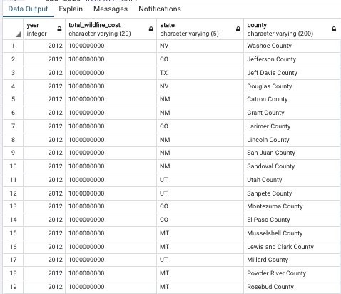

## Development Team 
1. [Yukie Kajita](https://github.com/yukiekajita)
2. [John Falcone](https://github.com/Apex8)
3. [Katy Luquire](https://github.com/CatherineLuquire)
